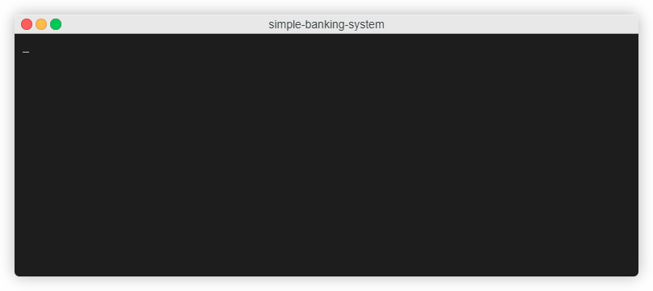

## Simple Banking System

Program simulates a bank terminal. User can create an account which geneerates a card number using _Luhn_ algorithm and PIN code. User can also log into his account and check balance, deposit, transfer money and delete an account. Data is stored id the database using hibernate.

The main purpose of writing this program was to practice writing algorithms and getting know with simple hibernate operations.

## Table of contents

- [Screencast](#screencast)
- [General info](#general-info)
- [Technologies](#technologies)
- [Status](#status)
- [Inspiration](#inspiration)

## Screencast

## General info

Start main at src/main/java/com/tadeeek/App.java

## Technologies

Java

## Status

Project is: _finished_

## Inspiration

Hyperskill project
